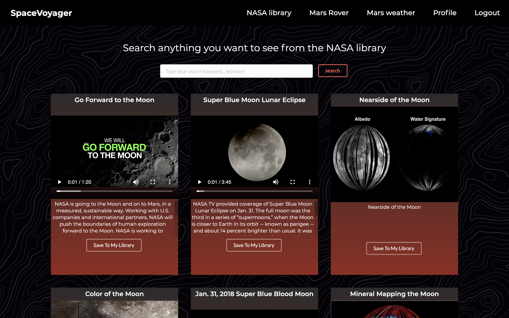
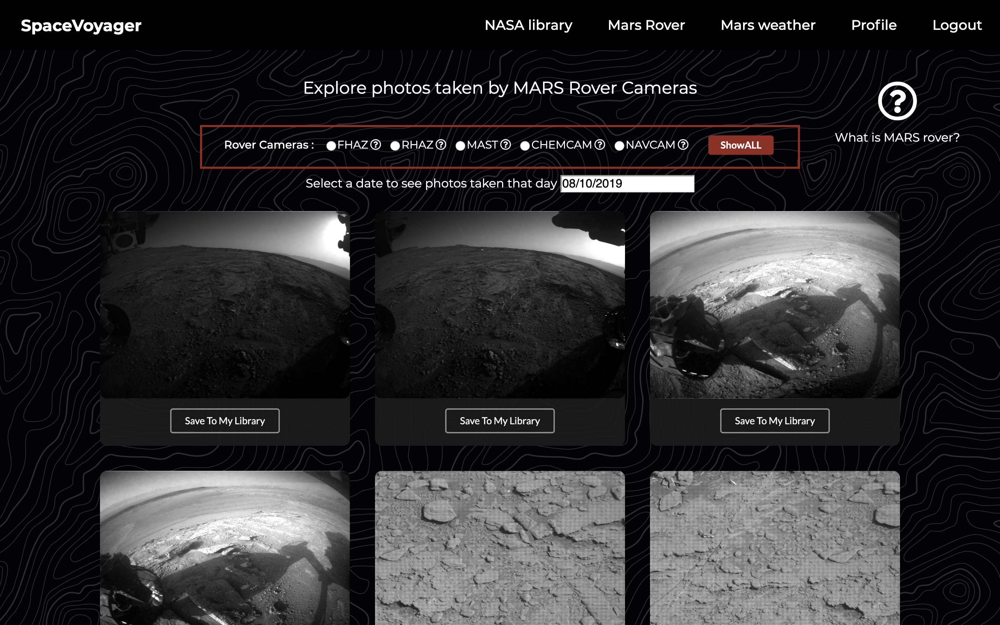
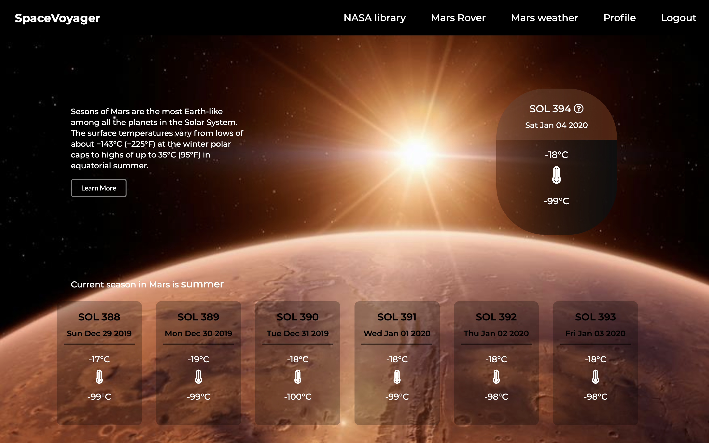
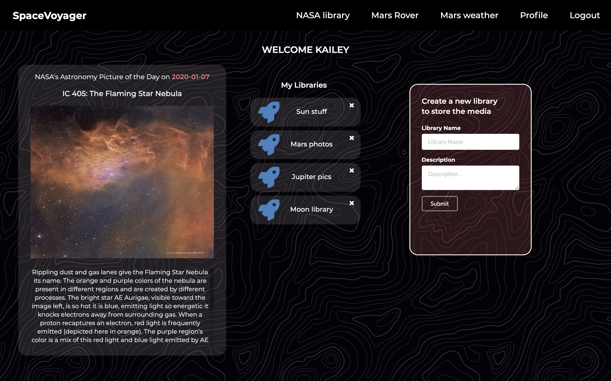

## SpaceVoyager backend
SpaceVoyager is a fun exploring single page web application where you can browse media from the NASA library and photos from the Mars rover Curiosity's cameras. You can check out the weather in Mars for the past week and NASA's astronomy picture of the day as well!

### This is a repository for SpaceVoyager's backend:
 - built with Ruby on Rails coupled with RESTful API and MVC pattern
 - has four models: User, Library, Save-item, and Item
 - has full validations and authentication with Bcrypt ruby gem and JWT token
 - dynamically communicating with multiple NASA APIs by fetching with Restclient gem
 - To start the whole application, please clone both of spacevoyager-backend and spacevoyager-frontend.

### To start the whole application, please clone both of spacevoyager-backend and spacevoyager-frontend.
You can find frontend at: https://github.com/kailey16/spacevoyager-frontend

### To start this backend repository:
1. open and run 'bundle install'
2. run 'rails s -p 3001'

#### To see a full demo, please look at: https://youtu.be/gCCKOJ1mQz8
   